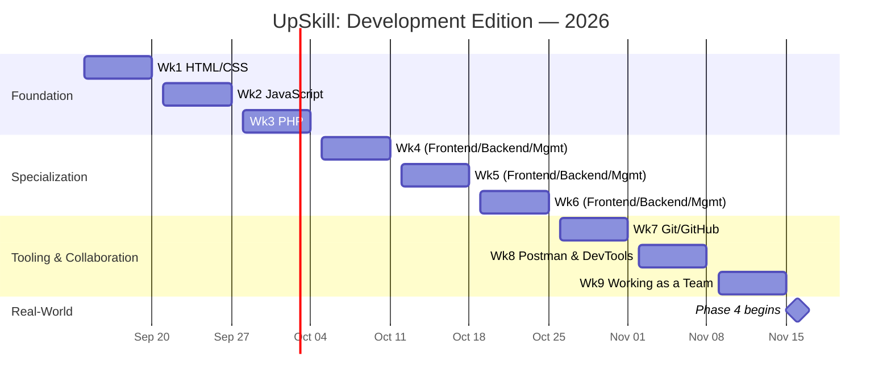
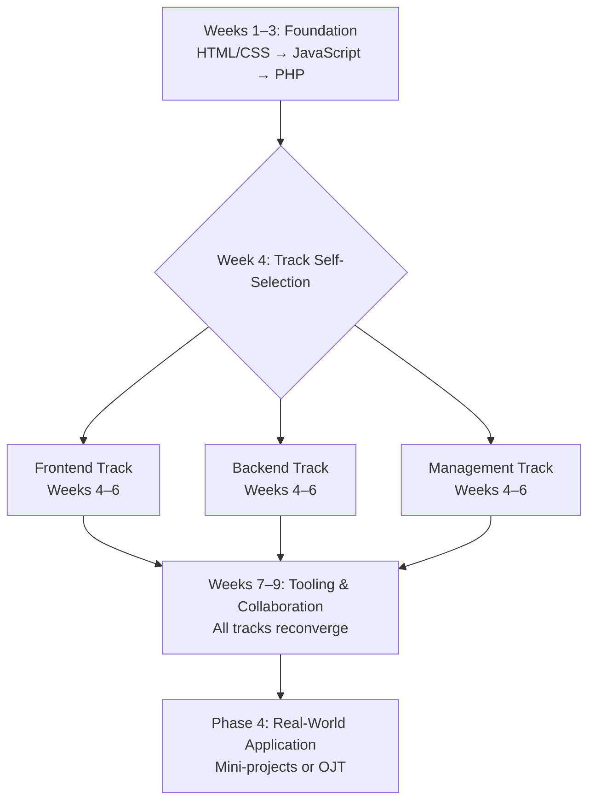
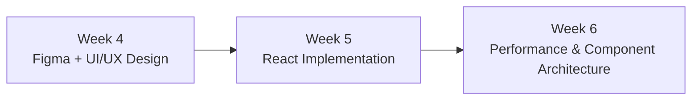
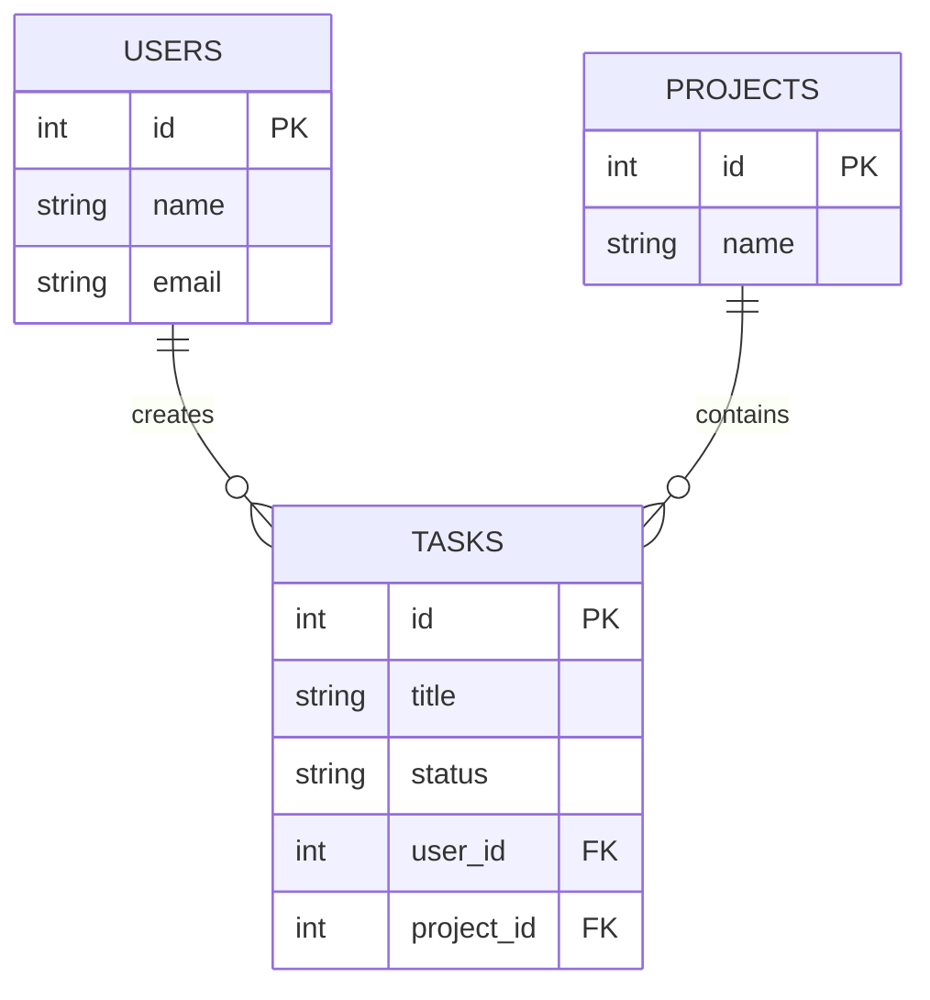

# UpSkill: Development Edition — Program Roadmap

**Program:** JPG UpSkill: Development Edition
**Leads:** Derick Xerxes A. Maquilang & Ethan Van Q. Gamat — Co-Development Team Heads, Junior Programmer Group (JPG)
**Runs:** September 14 – November 14, 2026 (9 weeks), with Phase 4 beginning the week of November 16, 2026
**Eligibility:** JPG Development Team members, JPG members in general, and any NDDU student currently enrolled in an IT/CS program

---

## Contents

1. [Program Overview](#program-overview)
2. [Phase 1 — Foundation (Weeks 1–3)](#phase-1--foundation-weeks-1-3)
3. [Phase 2 — Role Specialization (Weeks 4–6)](#phase-2--role-specialization-weeks-4-6)
4. [Phase 3 — Tooling & Collaboration (Weeks 7–9)](#phase-3--tooling--collaboration-weeks-7-9)
5. [Phase 4 — Real-World Application](#phase-4--real-world-application)
6. [Pending Decisions](#pending-decisions)
7. [Appendix — Documentation Templates Quick Reference](#appendix--documentation-templates-quick-reference)

---

## Program Overview

**Purpose:** take JPG Development Team members from web-dev fundamentals to the point where they can contribute to JPG's real, active projects — the NDDU Sanction System and the JPG Attendance App among them — through a shared foundation, a role-specialization track, a shared tooling bridge, and then real-world placement.

**Cadence, every week of Phases 1–3:** a live, 2-hour Monday-evening session over Discord, led by a peer mentor the Heads assign for that week, followed by an individual assignment. Documentation is due every Saturday at 11:59 PM. The following Monday opens with a short presentation/review of a few of those submissions — voluntary or hand-picked by EHIBE — before new content begins.

**The three JPG Development Team roles this program trains for:**

| Role | Covers |
|---|---|
| Frontend | UI/UX design, responsive web development, interactive interfaces |
| Backend & Infrastructure | Database management, API development, Linux administration, deployments |
| Management (Planning & Quality) | Project planning, technical documentation, automated testing, security auditing |

**The arc:**

| Phase | Weeks | Dates | What happens |
|---|---|---|---|
| 1 — Foundation | 1–3 | Sep 14 – Oct 3, 2026 | Everyone together: HTML/CSS → JavaScript → PHP |
| 2 — Specialization | 4–6 | Oct 5 – Oct 24, 2026 | Diverge into Frontend / Backend / Management, self-selected |
| 3 — Tooling & Collaboration | 7–9 | Oct 26 – Nov 14, 2026 | Reconverge: Git/GitHub (Wk7) → Postman & DevTools (Wk8) → Working as a Team (Wk9) |
| 4 — Real-World Application | — | begins week of Nov 16, 2026 | Mini-projects or OJT placement on active JPG projects |

---

## Phase 1 — Foundation (Weeks 1–3)

All participants attend together. Each week builds on the previous week's project — continuing the same project is encouraged, though a fresh start is fine too — so that by Week 3 everyone has one small full-stack-flavored artifact.

### Week 1 — HTML/CSS (Mon Sep 14 → Sat Sep 19, 2026)

**Agenda (2:00 total — this is Week 1, so there's no prior-week review block):**

| Time | Block |
|---|---|
| 0:00–0:10 | Welcome & program kickoff — what UpSkill is, the 9-week arc, expectations |
| 0:10–1:10 | HTML/CSS teaching block: semantic HTML5, the box model, Flexbox & Grid basics, responsive basics with media queries — live-coded demo of a small structured page |
| 1:10–1:35 | Guided practice / live Q&A — participants code along |
| 1:35–1:55 | Documentation Orientation — what a README is and why every real project has one; walk through the required sections (Project Description, Tech Stack, Features, Installation/Setup, Usage, Challenges & Key Learnings); a strong real-world README next to a weak one |
| 1:55–2:00 | Assignment briefing + wrap-up |

**Assignment:** build a small multi-section static page using semantic HTML5 and CSS — a header/nav, at least 3 content sections, a footer, a responsive layout (Flexbox or Grid), and deliberate styling (color scheme, typography). A personal portfolio or profile-card style page is a good default choice, since it naturally extends in Weeks 2–3.

**Mentor prep notes:**
- Have a working local demo ready to live-code from — don't build from a blank file cold
- Bring 2–3 real README examples (one strong, one weak) for the orientation segment
- Know Flexbox vs. Grid well enough to answer "which do I use when" on the spot

**Saturday deliverable (due Sep 19, 11:59 PM):** README — Project Description (+ screenshot), Tech Stack, Features, Installation/Setup, Usage, Challenges & Key Learnings. Full template in the [Appendix](#appendix--documentation-templates-quick-reference).

**Following Monday (Sep 21):** Week 2 opens with the program's first presentation/review block — 2–4 volunteers or EHIBE-picked participants share their Week 1 project and README, about 5–7 minutes each.

### Week 2 — JavaScript (Mon Sep 21 → Sat Sep 26, 2026)

**Agenda (2:00 total):**

| Time | Block |
|---|---|
| 0:00–0:15 | Opening — presentation/review of 2–4 Week 1 submissions |
| 0:15–1:15 | JavaScript teaching block: variables, functions, conditionals, loops; DOM manipulation; event listeners — live demo adding interactivity to the Week 1 page (e.g. a nav toggle, dynamic content) |
| 1:15–1:45 | Guided practice / live Q&A |
| 1:45–2:00 | Assignment briefing + wrap-up |

**Assignment:** extend last week's project with JavaScript interactivity: at minimum one DOM-manipulation feature (a toggle, accordion, or tabs), one event-driven feature (form validation or a button-triggered action), and at least one array/loop used to render or manipulate content dynamically.

**Mentor prep notes:**
- Have 2 small interactive demos ready to live-code (a toggle, a form validation)
- Know `querySelector`, `addEventListener`, and `classList` cold
- Anticipate the common beginner bugs — undefined variables, scope issues, listeners that don't fire — with quick fixes ready

**Saturday deliverable (due Sep 26, 11:59 PM):** README, updated — same template, reflecting the new JS features, updated tech stack, and new challenges/learnings.

**Following Monday (Sep 28):** review of Week 2 submissions, same format.

### Week 3 — PHP (Mon Sep 28 → Sat Oct 3, 2026)

**Agenda (2:00 total):**

| Time | Block |
|---|---|
| 0:00–0:15 | Opening — presentation/review of Week 2 submissions |
| 0:15–1:15 | PHP teaching block: syntax, variables, control structures, functions, arrays; embedding PHP in HTML; handling form submissions (`$_POST`/`$_GET`); a light intro to connecting to MySQL — live demo turning a static form into one PHP processes server-side |
| 1:15–1:45 | Guided practice / live Q&A |
| 1:45–2:00 | Assignment briefing + wrap-up |

**Assignment:** add a PHP-powered feature to the running project — a contact/feedback form that validates and processes input server-side. Echoing a confirmation or logging it is enough; full database storage isn't required yet. This should demonstrate `$_POST` handling, basic validation, and control structures.

**Mentor prep notes:**
- Send local PHP environment setup instructions (XAMPP/Laragon) before the session, so session time isn't lost to environment troubleshooting
- Have a working before/after example ready (static form → PHP-processed form)
- Know the common gotchas: undefined array keys, GET/POST mismatches

**Saturday deliverable (due Oct 3, 11:59 PM):** README, updated again.

**Following Monday (Oct 5):** review of Week 3 submissions, then the program moves into Phase 2.

---

## Phase 2 — Role Specialization (Weeks 4–6)

At the start of Week 4, each participant chooses one track — Frontend, Backend, or Management — through a short sign-up form at the end of Week 3, based on what they enjoyed most in Phase 1. From Week 4 on, the three tracks run as parallel sessions in separate voice channels, each with its own mentor.

All three tracks keep the same live, 2-hour, Monday-plus-Saturday-11:59-PM cadence — only the content and the documentation artifact change from week to week, shaped to what each role actually does.

### Frontend Track

Frontend isn't just CSS here — part of the role is becoming a working UI/UX designer, not only an implementer. The track runs as one pipeline: design the system properly first, build it faithfully, then harden it.

#### Week 4 — Figma & UI/UX Design Fundamentals (Mon Oct 5 → Sat Oct 10, 2026)

**Agenda (2:00 total):**

| Time | Block |
|---|---|
| 0:00–0:15 | Opening — presentation/review of Week 3 submissions (Frontend-track attendees) |
| 0:15–1:15 | UI/UX fundamentals: the design process (research → wireframe → mockup → prototype), core usability heuristics, visual hierarchy and consistency, an intro to design systems (color, type scale, spacing); Figma fundamentals: frames, components, auto-layout, basic prototyping |
| 1:15–1:45 | Guided practice / live Q&A — build one screen together in Figma |
| 1:45–2:00 | Assignment briefing + wrap-up |

**Assignment:** design a full small system in Figma for the project they'll build across Weeks 4–6 — at minimum a home/landing screen, a browse/list view, a detail view, a form/create view, and a confirmation/success state. Start as low-fidelity wireframes, move to a high-fidelity mockup pass, then wire up a basic clickable prototype connecting the main flow.

**Mentor prep notes:**
- Have a simple example Figma file ready (wireframe → mockup → prototype) to walk through live
- Know Figma's auto-layout well enough to demo it smoothly
- Bring one "good UI, bad UX" example to make the design-process point concrete

**Saturday deliverable (due Oct 10, 11:59 PM):** a Product Requirements Document (participants/owner, goals & objectives, background, assumptions, user stories, open questions, out-of-scope items) plus the Figma design file itself — wireframes through mockups through prototype, shared as a link — with a short written UX rationale covering who the user is and what the core flow solves. Full template in the [Appendix](#appendix--documentation-templates-quick-reference).

**Following Monday (Oct 12):** review of Week 4 submissions — presenters walk through their Figma prototype, not just the PRD.

#### Week 5 — Build It: React Implementation (Mon Oct 12 → Sat Oct 17, 2026)

**Agenda (2:00 total):**

| Time | Block |
|---|---|
| 0:00–0:15 | Opening — presentation/review of Week 4 submissions |
| 0:15–1:15 | React fundamentals: components, JSX, props, state, `useState` — live demo replicating one screen from a Figma mockup as a faithful, component-broken-down React page |
| 1:15–1:45 | Guided practice / live Q&A |
| 1:45–2:00 | Assignment briefing + wrap-up |

**Assignment:** rebuild the Week 4 Figma design as a real, working React app — component-driven from the start, and matched closely to the design: spacing, color, and typography fidelity, not just close enough.

This track uses React. JPG's own production stack runs on Vue.js, so Vue is a straightforward substitute here if the team would rather match the org's stack directly — nothing else in the track changes.

**Mentor prep notes:**
- Have a "Figma frame → React component tree" breakdown ready to demo — how to decide component boundaries
- Know `useState` and prop-passing cold; anticipate the "why isn't my UI updating" confusion
- Keep a design-fidelity checklist handy (spacing scale, color tokens, type scale) to review submissions against

**Saturday deliverable (due Oct 17, 11:59 PM):** README, updated — continuing the Phase 1 habit, now describing the React app.

**Following Monday (Oct 19):** review of Week 5 submissions — a side-by-side of the Figma design and the built page is an easy, concrete way to present.

#### Week 6 — Performance & Component Architecture, In Depth (Mon Oct 19 → Sat Oct 24, 2026)

Component architecture and performance are core Frontend skills, not a footnote, so this week goes deeper than a normal wrap-up week.

**Agenda (2:00 total):**

| Time | Block |
|---|---|
| 0:00–0:15 | Opening — presentation/review of Week 5 submissions |
| 0:15–1:15 | Component architecture: composition patterns, lifting state up, prop drilling and when to reach for Context, building small reusable component libraries. Performance: `React.memo`/`useMemo`/`useCallback` basics, code-splitting and lazy loading, bundle-size awareness, image optimization |
| 1:15–1:45 | Guided practice / live Q&A |
| 1:45–2:00 | Assignment briefing + wrap-up |

**Assignment:** refactor the project for better component architecture — at least one clear composition or state-lifting improvement — and apply at least 2 performance optimizations. Document a measurable before/after: a Lighthouse score, bundle size, or render-count check.

**Mentor prep notes:**
- Have a "before/after" refactor ready — a prop-drilled mess cleaned up into composed/Context-based code
- Have a Lighthouse (or similar) audit demo ready
- Know 3–5 quick, high-impact performance fixes to showcase

**Saturday deliverable (due Oct 24, 11:59 PM):** a Project Retrospective — what worked, what didn't, what they'd change, what's next.

**Following Monday (Oct 26):** a mini demo-day for the Frontend track — presenters show a before/after — before the program moves into Phase 3, where all tracks reconverge.

### Backend Track

This track covers Laravel and Blade only. Livewire and Filament are part of JPG's production stack, but trainees pick those up later, once they're working on live projects.

#### Week 4 — Laravel + Blade Fundamentals (Mon Oct 5 → Sat Oct 10, 2026)

**Agenda (2:00 total):**

| Time | Block |
|---|---|
| 0:00–0:15 | Opening — presentation/review of Week 3 submissions (Backend-track attendees) |
| 0:15–1:15 | Laravel setup (Composer, `laravel new`), routing, controllers, Blade templating (layouts, includes, `@if`/`@foreach`), passing data to views, Eloquent basics (models, migrations, basic CRUD) — live-built example: route → controller → Blade view → Eloquent model |
| 1:15–1:45 | Guided practice / live Q&A |
| 1:45–2:00 | Assignment briefing + wrap-up |

**Assignment:** set up a new Laravel project and build a basic CRUD flow for a simple resource — continuing their earlier project's theme, converting the static/PHP version into Laravel, or starting something small and new like "tasks" or "notes" — using routes, a controller, Blade views, Eloquent, and migrations.

**Mentor prep notes:**
- Pre-test and send local Laravel environment setup instructions ahead of time — Composer/PHP-version mismatches are the most common blocker
- Have a working reference repo ready
- Know the common beginner Eloquent errors — mass-assignment protection, migration ordering — cold

**Saturday deliverable (due Oct 10, 11:59 PM):** a Product Requirements Document for the Phase 2 project — same structure as the Frontend track's Week 4 (see [Appendix](#appendix--documentation-templates-quick-reference)).

**Following Monday (Oct 12):** review of Week 4 submissions, within the Backend track session.

#### Week 5 — API, Database & Data Modeling (Mon Oct 12 → Sat Oct 17, 2026)

This week adds a systems-analyst layer: before extending the data model in code, design it properly on paper first.

**Agenda (2:00 total):**

| Time | Block |
|---|---|
| 0:00–0:15 | Opening — presentation/review of Week 4 submissions |
| 0:15–1:15 | Data modeling like a systems analyst: reading and drawing an Entity-Relationship Diagram — entities, attributes, relationships, cardinality; writing a lightweight data dictionary (field name, type, description, constraints) for a table; then relational design basics (normalization basics, foreign keys, one-to-many / many-to-many) and building a JSON API endpoint (routes, returning JSON, validation) |
| 1:15–1:45 | Guided practice / live Q&A |
| 1:45–2:00 | Assignment briefing + wrap-up |

**Assignment:** draw an ERD for the project's data model — Mermaid, dbdiagram.io, drawSQL, or pen-and-paper photographed, any tool is fine — write a short data dictionary for its main table(s), then implement it: add at least one real relationship to the Eloquent models (for example, "tasks belong to a user") and expose at least one JSON API endpoint.

Example ERD, for reference — a simple tasks-app shape:

**Mentor prep notes:**
- Practice drawing an ERD live — crow's-foot notation is the common convention, one-to-many shown as `||--o{`
- Have a filled-out data-dictionary example ready as a model, not just a blank table
- Have a working validated-endpoint example ready

**Saturday deliverable (due Oct 17, 11:59 PM):** an ERD and short data dictionary for the project's data model, plus a README update covering the new API endpoint(s).

**Following Monday (Oct 19):** review of Week 5 submissions.

#### Week 6 — Deployment & Linux Basics (Mon Oct 19 → Sat Oct 24, 2026)

**Agenda (2:00 total):**

| Time | Block |
|---|---|
| 0:00–0:15 | Opening — presentation/review of Week 5 submissions |
| 0:15–1:15 | Linux/CLI basics (navigation, permissions), what a hosting environment looks like, `.env` and environment variables, a simplified deployment walkthrough framed around how a real JPG project — the NDDU Sanction System or the JPG Attendance App — actually gets deployed |
| 1:15–1:45 | Guided practice / live Q&A |
| 1:45–2:00 | Assignment briefing + wrap-up |

**Assignment:** document the deployment steps for their app; deploy to a free-tier host if mentor support and time allow.

**Mentor prep notes:**
- Bring real deployment war-stories — the gotchas are the most useful content here
- Pre-test whichever free hosting platform you plan to demo, since these change without notice

**Saturday deliverable (due Oct 24, 11:59 PM):** a Project Retrospective — what worked, what didn't, what they'd change, what's next.

**Following Monday (Oct 26):** demo-day format for the Backend track, before the program moves into Phase 3, where all tracks reconverge.

### Management Track

This track's throughline is producing real planning and QA artifacts rather than a coded project, practiced against a real JPG project — the NDDU Sanction System, the JPG Attendance App, or whatever a Frontend/Backend trainee is building that same month. Each Management trainee needs a project assignment before Week 4 (see [Pending Decisions](#pending-decisions)).

#### Week 4 — Project Planning, Agile Basics & Jira (Mon Oct 5 → Sat Oct 10, 2026)

**Agenda (2:00 total):**

| Time | Block |
|---|---|
| 0:00–0:15 | Opening — presentation/review of Week 3 submissions (Management-track attendees) |
| 0:15–1:00 | What project planning actually involves day to day; Agile/Scrum vocabulary (sprint, backlog, lightweight story points); breaking a vague goal into a task breakdown; how to write a Project Charter (objectives, scope, success criteria, stakeholders, risks, timeline) |
| 1:00–1:35 | Hands-on Jira: creating a project, issue types, backlog, building out a sprint — the actual tool, not just the theory |
| 1:35–1:45 | Guided practice / live Q&A |
| 1:45–2:00 | Assignment briefing + wrap-up |

**Assignment:** write a Project Charter for the assigned project, and set up a Jira project for it with an initial backlog (5–10 items) broken down from the charter's scope.

**Mentor prep notes:**
- Confirm each trainee's assigned project with EHIBE/Ethan before this session
- Bring a filled-out example charter to show as a model, not just a blank template
- Have a Jira project pre-built to walk through live — issue types, backlog view, a sprint

**Saturday deliverable (due Oct 10, 11:59 PM):** a Project Charter — objectives, scope (in/out), success criteria, stakeholders, risks, high-level timeline — plus a link to the Jira project. Template in the [Appendix](#appendix--documentation-templates-quick-reference).

**Following Monday (Oct 12):** trainees present their charter's key decisions and walk through their Jira backlog, within the Management track session.

#### Week 5 — Technical Documentation Practices (Mon Oct 12 → Sat Oct 17, 2026)

**Agenda (2:00 total):**

| Time | Block |
|---|---|
| 0:00–0:15 | Opening — presentation/review of Week 4 submissions |
| 0:15–1:15 | How documentation fits the SDLC; writing for a technical vs. non-technical audience; an overview of common doc types (README, PRD, API docs, style guides, ERDs) and when each is used; PRD practice |
| 1:15–1:45 | Guided practice / live Q&A |
| 1:45–2:00 | Assignment briefing + wrap-up |

**Assignment:** write a PRD for the same project as Week 4's charter.

**Mentor prep notes:**
- Bring 1–2 real PRD examples, simplified or anonymized if needed
- If schedule allows, run a short cross-track comparison — how does their PRD compare to a Frontend/Backend trainee's Week 4 PRD?

**Saturday deliverable (due Oct 17, 11:59 PM):** a Product Requirements Document — the same artifact type Frontend/Backend wrote in their Week 4, so all three tracks can compare notes on it from different angles.

**Following Monday (Oct 19):** review of Week 5 submissions.

#### Week 6 — Testing & Security-Auditing Fundamentals (Mon Oct 19 → Sat Oct 24, 2026)

The densest session in the program. The agenda is a fast, structured tour through the taxonomy; the assignment is where trainees build the full set out.

**Agenda (2:00 total):**

| Time | Block |
|---|---|
| 0:00–0:15 | Opening — presentation/review of Week 5 submissions |
| 0:15–0:40 | Test levels and the Master Test Plan: how a Master Test Plan — scope, entry/exit criteria, test strategy, schedule, risk — sits above individual test cases, extending the Week 6 test plan into that fuller shape |
| 0:40–1:15 | Test case design techniques, taught from the reference table below: white box (statement, branch, path, condition coverage) vs. black box (equivalence partitioning, boundary value analysis, decision tables, state transitions); then regression, end-to-end, and compatibility testing as test types layered on top |
| 1:15–1:40 | Wireframe/design coverage: checking a built product against its Figma wireframes and mockups — a natural pairing with the Frontend track's Week 4 deliverable — plus security and code-quality audit basics (naming the OWASP Top 10 at an awareness level, common code smells) |
| 1:40–2:00 | Guided practice — draft one test case of each type together — and assignment briefing |

**Reference: test case design techniques**

| Technique | Type | What it does |
|---|---|---|
| Statement coverage | White box | Every line of code executes at least once |
| Branch coverage | White box | Every conditional branch (if/else) is exercised |
| Path coverage | White box | Every possible execution path through the code is tested |
| Condition coverage | White box | Every individual logical condition is tested true and false |
| Equivalence partitioning | Black box | Group inputs into classes expected to behave the same; test one per class |
| Boundary value analysis | Black box | Test at the edges of valid/invalid input ranges |
| Decision table testing | Black box | Map combinations of conditions to expected outcomes in a table |
| State transition testing | Black box | Verify behavior as the system moves between defined states |

**Reference: test types**

| Type | Checks |
|---|---|
| Regression | Nothing that used to work broke after a change |
| End-to-end | A complete real user flow works start to finish |
| Compatibility | Behavior holds across browsers, devices, screen sizes, OSes |
| Wireframe/design coverage | The built UI actually matches what was designed |

**Assignment:** produce a Test Case Suite for the assigned project covering at least 2 white-box cases, 2 black-box cases, 1 regression case, 1 end-to-end case, and 1 compatibility case — plus a short wireframe/design-coverage check where the assigned project has a Figma design to check against, and the security/code-quality audit checklist.

**Mentor prep notes:**
- This is the heaviest content week — send the technique reference tables above as pre-reading, so session time goes to applied practice rather than first exposure
- Prepare the audit checklist in advance; keep it awareness-level, not a penetration-testing lesson
- Coordinate with the Frontend/Backend mentors beforehand if trainees will test or audit real trainee projects

**Saturday deliverable (due Oct 24, 11:59 PM):** a Master Test Plan (scope, entry/exit criteria, test strategy, schedule, risks), the Test Case Suite described above, and the security/code-quality audit checklist.

**Following Monday (Oct 26):** demo-day format — trainees present key findings from their test cases and audit — before the program moves into Phase 3, where all tracks reconverge.

---

## Phase 3 — Tooling & Collaboration (Weeks 7–9)

All three tracks reconverge into one shared session for these three weeks — still live, still a 2-hour cap, hands-on rather than lecture-heavy.

### Week 7 — Git/GitHub (Mon Oct 26 → Sat Oct 31, 2026)

A full week to itself this time — this is the one universal skill every track needs cold.

**Agenda (2:00 total):**

| Time | Block |
|---|---|
| 0:00–0:15 | Opening — cross-track share-out: since Weeks 4–6 ran separately, one quick highlight (about 5 minutes) from a volunteer per track on what they built |
| 0:15–1:00 | Git fundamentals: commits, branching, `.gitignore`, commit-message hygiene (conventional commits) |
| 1:00–1:40 | GitHub in depth: pull requests, resolving merge conflicts, a simple team workflow (GitHub Flow: branch → commit → PR → review → merge), Issues for linking work to tasks |
| 1:40–2:00 | Guided practice / live Q&A + assignment briefing |

**Assignment:** create a GitHub repo for the Phase 1–2 project, if it isn't already there, push the existing code, and open at least one pull request — even something small like a README fix — and have it reviewed by a peer.

**Mentor prep notes:**
- Have a pre-made "practice repo" ready in case someone's local project has git issues
- Practice resolving a merge conflict live before the session

**Saturday deliverable (due Oct 31, 11:59 PM):** README, updated, plus confirmation the project is now on GitHub with commit history (link included in the README).

**Following Monday (Nov 2):** review of Week 7 submissions — PRs opened, review comments.

### Week 8 — Postman, Browser DevTools & Related Tools (Mon Nov 2 → Sat Nov 7, 2026)

**Agenda (2:00 total):**

| Time | Block |
|---|---|
| 0:00–0:15 | Opening — presentation/review of Week 7 submissions |
| 0:15–0:50 | Postman/Insomnia for API testing: requests, environments and variables, basic checks — ties back to the Backend track's Week 5 API work |
| 0:50–1:35 | Browser DevTools, properly: Elements/Inspector, Console, Network tab (reading requests, status codes, timing), Application/Storage tab, responsive device mode, a Lighthouse audit walkthrough |
| 1:35–1:50 | A quick survey of other useful tools: framework-specific DevTools extensions (React/Vue DevTools) for Frontend folks, a couple of high-value VS Code extensions |
| 1:50–2:00 | Assignment briefing + wrap-up |

**Assignment:** test and document at least one API endpoint in Postman, saving the request or collection. Separately, use browser DevTools to find and document one real issue in the project — a Network, Console, or performance finding — and note the fix.

**Mentor prep notes:**
- Have a sample Postman collection ready to show or import
- Have a "bug hunt" demo ready — a real DevTools-found issue and how it got fixed

**Saturday deliverable (due Nov 7, 11:59 PM):** README, updated with the API testing notes and the DevTools debugging finding.

**Following Monday (Nov 9):** review of Week 8 submissions.

### Week 9 — Working as a Team (Mon Nov 9 → Sat Nov 14, 2026)

**Agenda (2:00 total):**

| Time | Block |
|---|---|
| 0:00–0:15 | Opening — presentation/review of Week 8 submissions |
| 0:15–1:00 | Agile/Scrum basics: sprints, standups, backlog grooming, made concrete with an actual 5-minute mock standup (Management trainees already covered Jira in Week 4 — this is the rest of the cohort catching up) |
| 1:00–1:30 | Task-tracking for everyone: a GitHub Projects walkthrough, since they're already living in GitHub from Week 7, with Jira and Trello named as what they'll likely meet in a real workplace |
| 1:30–1:50 | Code-review etiquette — giving and receiving PR feedback — and communication norms for a remote/hybrid student team |
| 1:50–2:00 | Wrap-up and transition briefing into Phase 4 |

**Assignment:** set up a GitHub Projects board for the Phase 1–2 project (or a small new one), populate it with a 5–10 item backlog across To Do / In Progress / Done, and write at least one task as a proper user story.

**Mentor prep notes:**
- Prepare a light mock-standup script to keep it moving
- Have a filled example GitHub Projects board ready as a model

**Saturday deliverable (due Nov 14, 11:59 PM):** a whole-program Project Retrospective — what they learned across all 9 weeks, biggest challenges, what they're most proud of, what they want to focus on in Phase 4.

**Following Monday (Nov 16):** the last Monday of the structured program runs as a full showcase — each participant gets a short slot to present — before the cohort moves into Phase 4.

---

## Phase 4 — Real-World Application

After Phase 3 wraps, participants move into mini-projects or get placed on JPG's active projects — the NDDU Sanction System, the JPG Attendance App, and others — at the discretion of the JPG heads. Placements begin the week of November 16, 2026; the specifics will follow once EHIBE and Ethan finalize them.

---

## Pending Decisions

A few things need to be locked in before Week 1:

- **Headcount** — final participant count, once sign-ups close.
- **Mentor assignments** — who leads each session; the Heads assign mentors week by week.
- **Management trainee project assignments** — which project each Management trainee works against (the NDDU Sanction System, the JPG Attendance App, or a Frontend/Backend trainee's Phase 2 project), needed before Week 4.

---

## Appendix — Documentation Templates Quick Reference

Every documentation format used across the program, in one place.

**README** *(Weeks 1–3, all tracks; Week 5 Frontend; Weeks 7–8, all tracks)* — the standard open-source repo convention:
- Project Description (with a screenshot or GIF)
- Tech Stack
- Features
- Installation/Setup
- Usage
- Challenges & Key Learnings

**Product Requirements Document** *(Week 4 Frontend/Backend; Week 5 Management)* — trimmed from standard product-management practice:
- Participants/owner
- Goals & objectives
- Background / why it matters
- Assumptions
- User stories
- Basic UI/interaction sketch
- Open questions
- Out-of-scope items

**Figma Design File** *(Week 4 Frontend)* — the design deliverable itself:
- Low-fidelity wireframes for each key screen
- High-fidelity mockups, with color, type, and spacing applied
- A basic clickable prototype connecting the core flow
- A short written UX rationale — who the user is, what the flow solves

**Entity-Relationship Diagram + Data Dictionary** *(Week 5 Backend)* — systems-analyst-style data modeling:
- ERD: entities, attributes, relationships, cardinality (crow's-foot notation is the common convention)
- Data dictionary: field name, type, description, and constraints for each main table

**Project Charter** *(Week 4 Management)* — trimmed from standard project-management practice:
- Objectives
- Scope (in/out)
- Success criteria
- Stakeholders
- Risks
- High-level timeline

**Project Retrospective** *(Week 6 Frontend/Backend; Week 9, all tracks — whole-program version)* — standard end-of-sprint/postmortem format:
- What worked
- What didn't
- What they'd change
- What's next

**Master Test Plan + Test Case Suite** *(Week 6 Management)* — the umbrella plan, and the individual cases underneath it.

Master Test Plan:
- Scope (features to test / not to test), entry/exit criteria
- Test strategy — which test types apply
- Schedule
- Risks

Test Case Suite — individual cases spanning:

| Category | Techniques / types included |
|---|---|
| White box | Statement, branch, path, condition coverage |
| Black box | Equivalence partitioning, boundary value analysis, decision tables, state transitions |
| Regression | Confirms nothing that worked before broke |
| End-to-end | A full real user flow, start to finish |
| Compatibility | Across browsers, devices, screen sizes |
| Wireframe/design coverage | Built UI checked against the Figma design |

Plus a short security/code-quality audit checklist, kept at awareness level.
